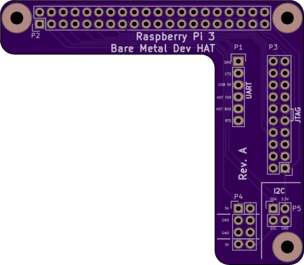

# Raspberry Pi 3 Bare Metal Dev HAT

This repository contains KiCad design files for an **experimental** Raspberry
Pi "pseudo-HAT" (lacking an ID EEPROM) that breaks out the JTAG and UART pins
to an ARM-style JTAG header and a 6-pin "FTDI header" respectively. The goal
is to make it easy to connect diagnostic tools from a host development machine
when working on bare-metal software for the Raspberry Pi 3.

The author makes no promises or warranty about the quality or functionality of
this PCB design. Your mileage may vary. However, if you would like to give it a
try, either clone the repo and load the project into KiCad or download the
Gerber files attached to one of the
[tagged revisions](https://github.com/apparentlymart/raspi-jtag-hat/releases).

The board also includes extra breakouts for the I2C pins and the power pins
from the main header, as an optional convenience. It might also work for
Raspberry Pi 2, but its unusual L-shape is intended to avoid conflicts with
the larger heatsinks that some owners fit to their Raspberry Pi 3 units.

The following is an example BOM for some through-hole components that could
be used to populate this PCB:

| Ref. | Description                     | Octopart Id                                                                                               |
| ---- | ------------------------------- | --------------------------------------------------------------------------------------------------------- |
| P1   | "FTDI-style" UART header        | [22-28-4063-molex-278209](https://octopart.com/22-28-4063-molex-278209)                                   |
| P2   | Raspberry Pi Main header socket | [hif3h-40da-2.54dsa(71)-hirose-22821340](https://octopart.com/hif3h-40da-2.54dsa%2871%29-hirose-22821340) |
| P3   | "ARM-style" JTAG socket         | [htst-110-01-l-d-samtec-6823793](https://octopart.com/htst-110-01-l-d-samtec-6823793)                     |
| P4   | Misc. Power header              | [10-89-7082-molex-20831](https://octopart.com/10-89-7082-molex-20831)                                     |
| P5   | I2C header                      | [10-89-7042-molex-35512](https://octopart.com/10-89-7042-molex-35512)                                     |
